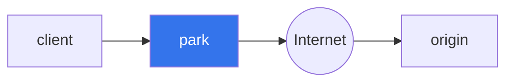
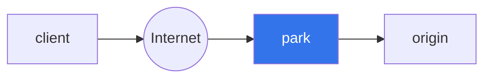

Park is a layer 7 (HTTP) proxy that allows you to observe and replay requests using HTTP Archive (har) files.

## Quick Start

1. Proxy requests to http://www.example.com
```
$ park http://www.example.com
Proxy listening on 127.0.0.1:59453
API listening on 127.0.0.1:44234
```

2. In a separate terminal session, send a request
```
$ curl --silent -o /dev/null -H 'Host: www.example.com' http://127.0.0.1:59453/
```

3. Download the results using the park API
```
$ curl 127.0.0.1:44234/api/requests/latest.har -o latest.har
```

- Guide
- Documentation


Configuration

Global

- log_style - style of logs. Options: plain, json. Defaults to plain.
- har_queue - size of the queue that writes har files to the db. Default is 1,000

Db

- uri - sqlite uri. Defaults to tempfile.
- max_size - maximum size of the database. Old HTTP transactions will be purged. Defaults to 100 MiB.

Server

- bind - listen for requests on a given IP address and port. Defaults to 127.0.0.1:0
- backend - backend server. Required as a command line parameter or configuration. Options:
   - IP address and port. Only http is supported
   - URI - only requests with a matching scheme and Host header will be sent.
- max_connections - maximum number of TCP connections. Defaults to 10. See https://www.artificialworlds.net/blog/2021/01/08/limiting-the-number-of-open-sockets-in-a-tokio-based-tcp-listener/
- client_timeout
- server_timeout
- ssl_cert - /path/to/ssl/certs/mycert.pem. Required if you want to accept TLS connections.


Note: There is no configurable connection timeout because park will eagerly connect to the backend server and re-use connections. Park will wait ??? to establish an initial connection on startup.

Any request that does not match the backend server will receive a 200 response. An `info` log message will be emitted that not match was found.


Should I use work stealing or single core per worker?


Blog posts

Because Access Logs Are Not Enough - Discuss how we could have used park to quickly figure out where the HTTP 1.0 request was coming from.

Random 500 errors - Discuss how we could have used park to quickly figure out what requests are causing errors on ws.narvar.com. Specifically, the Humana issues.


## Observe Requests

Every request proxied through park will save a har file in a SQLite database. You can query the SQLite database directly or use the API to find and download the har file.

You can use this file to observe exactly what happened with the request.

## Replay Requests

Imagine you have a service calls an important webhook run by a third party. The third party contacts you and requests that you re-send some webhook requests that they lost. If you had proxied these requests through park, you can replay any request.

1. Identify all the requests that need to be replayed
1. Call `POST /api/requests` using the har file as the body. DOES THIS NEED A SPECIAL CONTENT-TYPE?

Park will use the request portion of the har file to replay the request.

You may be wondering why we upload the har file instead of doing something like `POST /api/requests/:id/replay`. The reason is that we can also fix broken requests.

### Fixing Malformed Requests

Imagine you have a webhook that one or more third parties call. For one third party, a code change on their end causes the request body to be invalid causing many requests to fail. You contact them and they revert the change, but they have no way to replay the requests that failed. Park allows you to edit the request body of the failed requests and replay them.

1. Identify all of the requests that are malformed and need to be replayed.
1. Edit the har file and fix the issue.
1. Call `POST /api/requests` using the har file as the body. DOES THIS NEED A SPECIAL CONTENT-TYPE?


## Forward Proxy
Clients that send web requests directly to an origin can instead send the requests to park. Park will log the request and send it to the origin.

Some common use cases that park will solve:
- Park will retry requests if the origin is unhealthy or if there is a network error.
- Park will send alerts for requests that fail a certain number of retries.
- Park allows the request headers and body to be edited if the origin rejects the request.

## Reverse Proxy
Origins that receive HTTP requests directly from the client can instead have the requests send to park. Park will log the request and send it to the origin.

Some common use cases that park will solve:
- Park immediately logs all incoming HTTP requests so you never drop a request.
- Park will retry any requests that fail at the origin.
- Park allows requests to be edited in case the client sends a malformed request.


> [!NOTE]
> Park is still under active development.

Park includes functionality to improve the resiliency of HTTP requests, including:
- retrying requests that fail.
- sending alerts for requests that fail a certain number of retries.
- editing of the request headers and body.

Park can be used as a foward proxy to add resiliency to the client sending HTTP requests or a reverse proxy to add resiliency to the origin receiving the HTTP request.

## Forward Proxy
Clients that send web requests directly to an origin can instead send the requests to park. Park will log the request and send it to the origin.

Some common use cases that park will solve:
- Park will retry requests if the origin is unhealthy or if there is a network error.
- Park will send alerts for requests that fail a certain number of retries.
- Park allows the request headers and body to be edited if the origin rejects the request.

## Reverse Proxy
Origins that receive HTTP requests directly from the client can instead have the requests send to park. Park will log the request and send it to the origin.

Some common use cases that park will solve:
- Park immediately logs all incoming HTTP requests so you never drop a request.
- Park will retry any requests that fail at the origin.
- Park allows requests to be edited in case the client sends a malformed request.

## Basic Example

Start the example origin server: `cargo run --example origin`

In a separate terminal window, start park: `RUST_LOG=park=trace cargo run`

In a separate terminal window, run the following curl requests:

Create an origin so park knows how to route incoming requests:

```
curl -vvv -H "Content-Type: application/json" localhost:3443/origins \
-d '{ "domain": "example.wh.park.dev", "origin_uri": "http://localhost:8080", "timeout": 100 }'
```

Send a request that will succeed:

```
curl -vvv -H "Host: example.wh.park.dev" localhost:3000/ -d ''
```

Send a request that will fail:

```
curl -vvv -H "Host: example.wh.park.dev" localhost:3000/failure -d ''
```

This request will be retried repeatedly by the retry queue.


In the terminal window running park, you will see a lot of tracing output that demonstrates how park is running.

### Management UI

The management UI makes it easier to manage the proxy settings and troubleshoot issues. It runs independently of the proxy server. It requires a URL to the management API.

Start the proxy server:

```
RUST_LOG=park=info cargo run -- --config-path=park.example.toml
     Running `target/debug/park --config-path=park.example.toml`
2024-01-01T20:30:23.213548Z  INFO park: starting retry queue
2024-01-01T20:30:23.213548Z  INFO park: ingest listening on 0.0.0.0:3000
2024-01-01T20:30:23.213549Z  INFO park: management API listening on 0.0.0.0:3443
```

The management API is listening on port 3443. We can run the UI local to the server like this:

```
RUST_LOG=ui=info cargo run --bin ui -- --api-url=http://localhost:3443
   Compiling ui v0.0.0 (/Users/herman/Code/park/crates/ui)
    Finished dev [unoptimized + debuginfo] target(s) in 3.26s
     Running `/Users/herman/Code/park/target/debug/ui '--api-url=http://localhost:3443'`
2024-01-13T17:09:52.115907Z  INFO ui: listening on 127.0.0.1:8888
```

## Use Cases

- You have a service that sends transactional emails to an email service provider (ESP) and your ESP has planned (or unplanned!) downtime. Park will alert you, queue your messages and retry them until the service comes back up.
- You have a service calls an important webhook run by a third party. The third party contacts you and requests that you re-send some webhook requests that they lost. Park keeps a record of completed requests that can be replayed by calling an API or using the UI.
- A third party calls your webhook. A code change on their end causes the request body to be invalid causing many requests to fail. You contact them and they revert the change, but they have no way to replay the requests that failed. Park allows you to edit the request body of the failed requests and replay them.

## Design

Park is designed to be used with HTTP requests that pass messages to an origin and only expect acknowledgement of the request. [Shopify Webhooks](https://shopify.dev/docs/apps/webhooks) are a good example of these types of HTTP requests. HTTP requests that expect a response body based on the request payload are not a good fit for Park. [Dialogflow CX Webhooks](https://cloud.google.com/dialogflow/cx/docs/concept/webhook) are an example of the types of implementations that park is not designed to support.

## Comparisons
### AWS EventBridge
AWS EventBridge enables event sourcing by transforming HTTP requests into events. Events are stored in a log and can be replayed. Events that contain incorrect data can be edited by using input transformation, but input transformation was not designed to support ad-hoc editing of event data.

Park has no opinions on event sourcing. Instead, park aims to be a transparent proxy that provides resiliency to your incoming HTTP requests. If your internal architecture already uses event sourcing, then you may not need park.

## License

Park is licensed under the [Elastic License 2.0 (ELv2)](https://github.com/hjr3/park/blob/master/LICENSE.md) license because it provides the best balance between freedom and protection. The ELv2 license is a permissive license that allows you to use, modify, and distribute park as long as you follow a few simple rules:

1. **You may not provide park to others as a managed service.** For example, you _cannot_ host park yourself and sell it as a cloud-based licensing service. However, you _can_ sell a product that directly exposes and utilizes park, as long as park cannot be used outside of your product for other purposes.

1. **You may not circumvent the license key functionality or remove/obscure features protected by license keys.** You _cannot_ remove or change the licensing code to, for example, unlock a paid/enterprise feature.

1. You may not alter, remove, or obscure any licensing, copyright, or other notices.

Anything else is fair game. There's no clause that requires you to open source modifications made to park or other derivative works. You can fork park and go closed-source.

### Contribution

Unless you explicitly state otherwise, any contribution intentionally submitted
for inclusion in the work by you, as defined in the Apache-2.0 license, shall be dual licensed as above, without any
additional terms or conditions.
